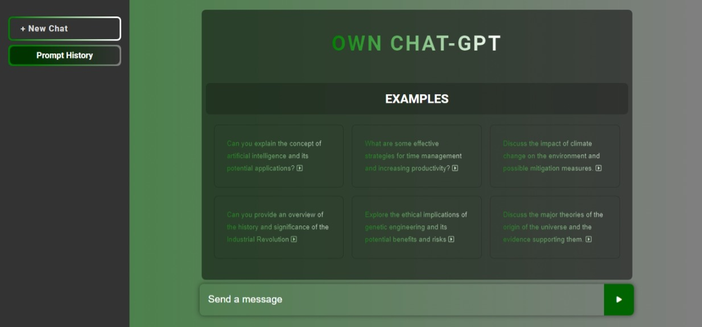

# OWN CHAT-GPT
---
## Project Detail
- The project was about combining the ChatGPT API with a frontend application. Users can type messages, and the application shows a conversation where the computer-generated responses are added below the previous messages. The design of the application user interface is intuitive and user-friendly and is easy to use. It was built using HTML, CSS, and JavaScript. The JavaScript code handles user input well, sends requests to the ChatGPT API, and shows the responses instantly.
---
## Deploy Method
- To deploy your own chat-gpt app you need to create a "config.js" file inside "js" folder
- You need to provide your Api Key inside "config.js" file.

- The "config.js" file content Example:- 
```javascript
const config = {
    API_KEY: 'Your_open_ai_Api_Key'
};
```
- Now you can upload files your favorite hosting 
---
### OWN CHAT-GPT Screenshot
